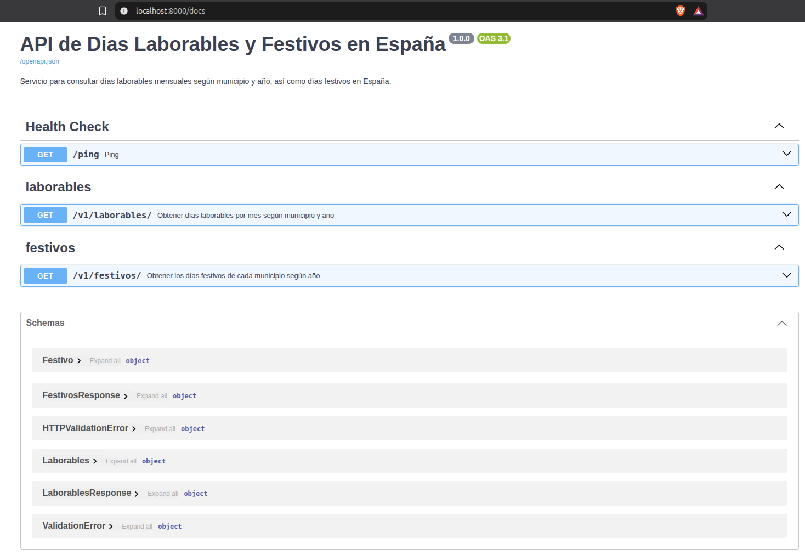
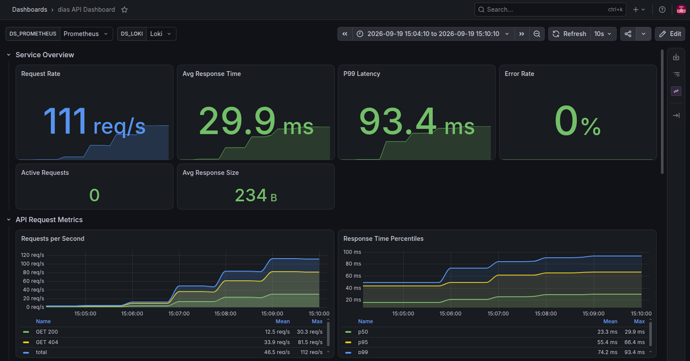
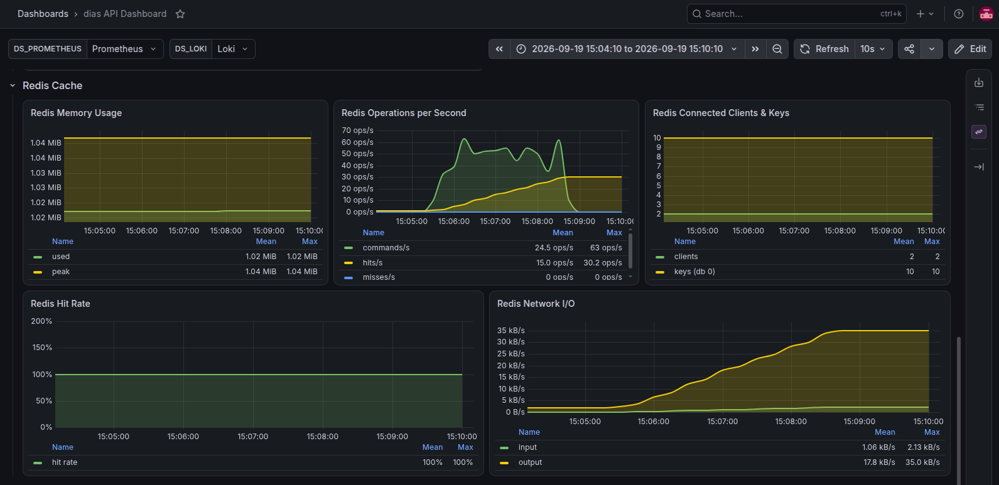
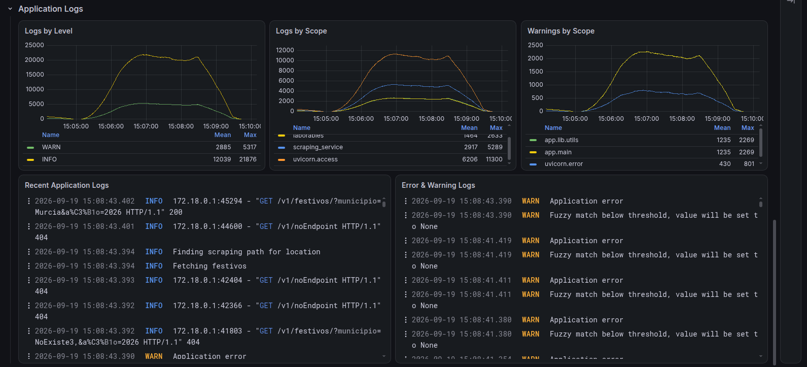
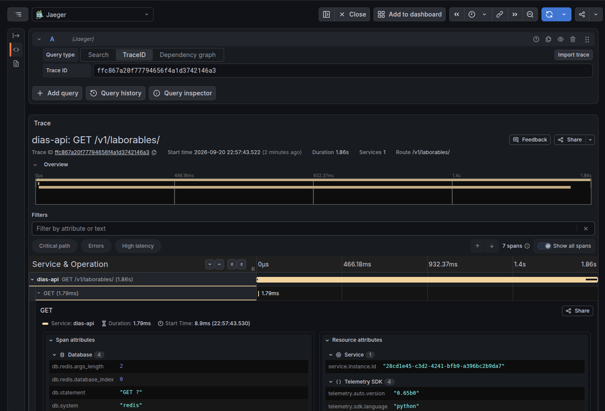

# Días API

API en castellano para la obtención de los días laborables por mes de algunos municipios españoles a partir de los calendarios disponibles en https://calendarios.ideal.es. También se ofrece un listado de días festivos por municipio y año.



## Propósito
La finalidad del proyecto recae en poder **añadir observabilidad** a una API sencilla mediante la generación, recolección y visualización de **metricas**, **registros** y **trazas**. Para ello se ha optado por utilizar la instrumentalización de **OpenTelemetry** limitando lo máximo posible el acoplamiento del framework de observabilidad al resto de la aplicación.

Del mismo modo, se trata de un ejercicio para aplicar abstracciones mediante la separación de responsabilidades, inyección de dependencias o el manejo y jerarquización de errores.

Como finalidad última, sirve para practicar CI con GitHub Actions.

### ¿Por qué OpenTelemetry?

La selección de este framework de observabilidad reside en que es un estándar abierto y soportado por la *Cloud Native Computing Foundation* (CNCF). Además, permite futuras migraciones a plataformas SaaS de observabilidad como Datadog o New Relic, entre otras, por lo que es una opción que evita el *vendor locking*.

## Stack

### Gestor de dependencias
- UV (Python 3.12)

### Framework y librerías no estándar
- FastAPI
- requests
- BeautifulSoup4

### Observabilidad
- OpenTelemetry (Framework de observabilidad)
- OpenTelemetry collector (agente de recolección de trazas, métricas y logs)
- Jaeger (trazas)
- Prometheus (métricas)
- Loki (logs)
- Grafana (dashboard de visualización y agregación de trazas, métricas y logs)

### Cache
- Valkey (sustituible con Redis)

### Contenedores
- Docker 

## Despligue en local

Es suficiente con ejecutar el siguiente comando desde la raíz del proyecto:

```bash
docker compose up --build
```
La API se encontrará disponible en http://localhost:8000 (redirige a la documentación interactiva de la API) y el panel de observabilidad en http://localhost:3000 cuyas credenciales por defecto es `admin:admin`.

No se recomienda acceder a la UI de Jaeger(http://localhost:16686) directamente ya que la versión empleada no tiene un buen contraste de colores y dificulta la lectura en general de la interfaz. Se recomienda acceder a las trazas desde el panel de Grafana.

### Variables de entorno

Véase el archivo `.env.example` para conocer las variables de entorno necesarias para la ejecución del proyecto. No es estrictamente necesario crear un archivo `.env` ya que las variables de entorno se encuentran definidas en el `docker-compose.yml`. No obstante, si se desea ejecutar únicamente la API sin Docker ni telemetría, es necesario crear un archivo `.env` con las variables de entorno necesarias y ejecutar la aplicación mediante `uv sync && uv run fastapi dev`.


## Capturas (panel de observabilidad)

### Panel de la API:



### Metricas de la cache:



### Panel de logs:



### Trazas:

